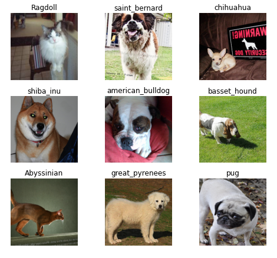
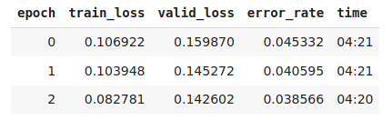

# pets_classifier

Model performed with __fastai__ library (v1).

Model trained using [Oxford-IIIT Pet Dataset](http://www.robots.ox.ac.uk/~vgg/data/pets/) by O. M. Parkhi et al., 2012 which features 12 cat breeds and 25 dogs breeds. According to their paper, the best accuracy they could get in 2012 was 59.21%, using a complex model that was specific to pet detection, with separate "Image", "Head", and "Body" models for the pet photos.

- Results: With resnet50 as the architecture chosen, our model got an accuracy of 96.14%.

_error_rate showed instead (error_rate = 1 - accuracy)._
